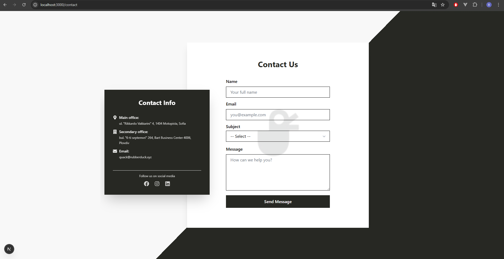

# 📬 Contact Form 

## 🚀 Overview

This is a modern and responsive **Contact Form** built using the latest web technologies:  
**Next.js 15 (App Router), React 19, TypeScript, Resend, Zod, TailwindCSS, Radix UI**, and more.

It features form validation, stylish UI, success modals, and seamless email sending via Resend.

---

## 🛠️ Tech Stack

- **Next.js 15** (App Router)
- **React 19**
- **TypeScript**
- **TailwindCSS**
- **Radix UI** & **Headless UI**
- **Zod** for schema validation
- **React Hook Form** for form state management
- **Resend** for transactional email sending
- **Lucide Icons**, **Heroicons**, **React Icons**

---

## 📂 Project Structure

```
contact-form/
├── public/
│   └── img/
│       ├── contact_form.png.png      # Form screenshot
│       ├── rubDuck.png               # Rubber Duck icon
│
├── src/
│   ├── app/
│   │   ├── api/
│   │   │   └── contact/
│   │   │       └── route.ts          # API route for sending email via Resend
│   │   └── contact/
│   │       ├── favicon.ico           # Page favicon
│   │       ├── globals.css           # Global styles
│   │       ├── layout.tsx            # App layout
│   │       └── page.tsx              # Contact page
│   │
│   ├── components/
│   │   └── ui/
│   │       ├── dialog.tsx            # UI dialog base
│   │       ├── SelectField.tsx       # Custom select input
│   │       ├── SuccessDialog.tsx     # Modal shown on success
│   │       ├── ContactForm.tsx       # Main contact form logic
│   │       └── ContactInfo.tsx       # Display for contact details
│   │
│   └── lib/
│       ├── resend.ts                 # Resend API configuration
│       ├── utils.ts                  # Utility functions
│       └── validation.ts             # Zod schema definitions
│
├── .env.local                        # Environment variables (Resend API key & sender email)
├── .gitignore
├── components.json                   # Tailwind config (e.g., with shadcn or other UI lib)
├── eslint.config.mjs                # Linting configuration
├── LICENSE
├── next.config.ts                   # Next.js config
├── next-env.d.ts                    # TypeScript environment types
├── package-lock.json
├── package.json                     # Project metadata and scripts
```

---

## ⚙️ Getting Started

### 1. Clone the repository

```bash
git clone https://github.com/your-username/contact-form.git
cd contact-form
npm install
npm run dev
```

### 2. Environment Setup

Create a `.env.local` file in the root directory and add your Resend credentials:

```env
RESEND_API_KEY=your_resend_api_key
RESEND_FROM_EMAIL=onboarding@resend.dev
```

⚠️ Replace `your_resend_api_key` with the actual key from your [Resend account](https://resend.com/).

---

### 3. Update the sender email

In `src/app/api/contact/route.ts`, locate this section:

```ts
to: 'vikiveleva54@gmail.com',
```

Replace `'vikiveleva54@gmail.com`` with your email address where you want to receive messages.

---

## 📸 Screenshot

Here’s a quick preview of the UI:



---

## ✅ Features

- 📬 Send fully customizable emails using Resend  
- ✅ Validate input using Zod  
- 🎨 Beautiful UI with TailwindCSS + Radix UI  
- ⚡ Smooth modals & field animations  
- 📱 Fully responsive  
- 🧠 Type-safe with TypeScript  
- 🔧 Easy to maintain and extend  

---

## 🪪 License

This project is open source and available under the **MIT License**.

---

## 🙌 Acknowledgments

Thanks to:

- [Resend](https://resend.com/)
- [Zod](https://zod.dev/)
- [React Hook Form](https://react-hook-form.com/)
- [TailwindCSS](https://tailwindcss.com/)
- [Radix UI](https://www.radix-ui.com/)

---
